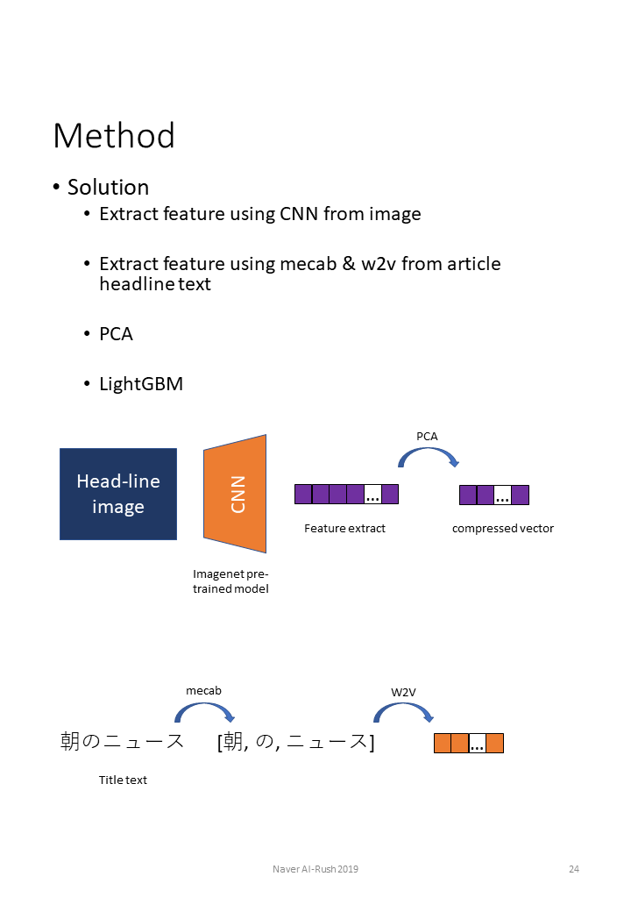
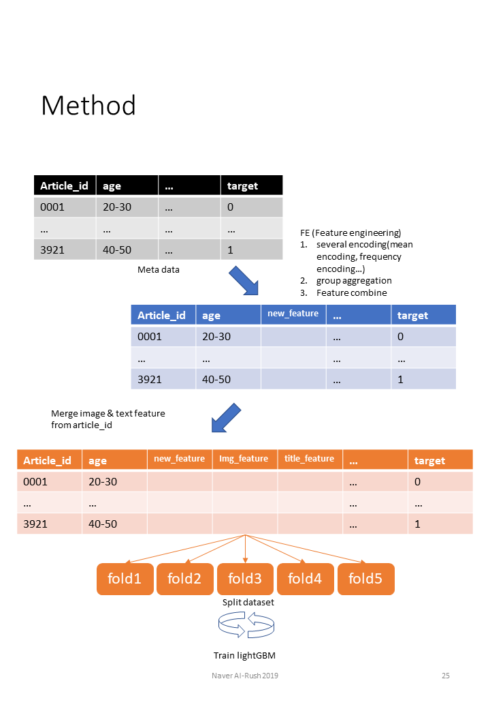

# airush problem2 
airush2 dataloader and evaluator for nsml leader board
# Click-Through rate Prediction

### 1. 설명 Description
CTR prediction trains a model on features such as the user's gender, age, geography, and ad exposure time,
The problem of predicting whether or not to click an ad is a very successful task.

Since you're never going to click on ads (more than 95%), you'll need an idea to overcome data imbalance issues in terms of modeling and data preprocessing.

Because of the large number of data samples, speed is also very important.

The dataset consists of the following:

```
number of classes : 2 (clicked or not)
number of train samples : 4,050,309
number of test samples : 101,251
% of clicked samples   : 6%
Feature specification: (label - label, article_id - image file name, hh - an exposure time of advertising, 
                        gender - user gender, age_range - user age, read_article_ids - Search history) + 
                        Extracted image feature using ResNet50
evaluation metric : F1 score
```

</img><br/>

</img><br/>

</img><br/>


